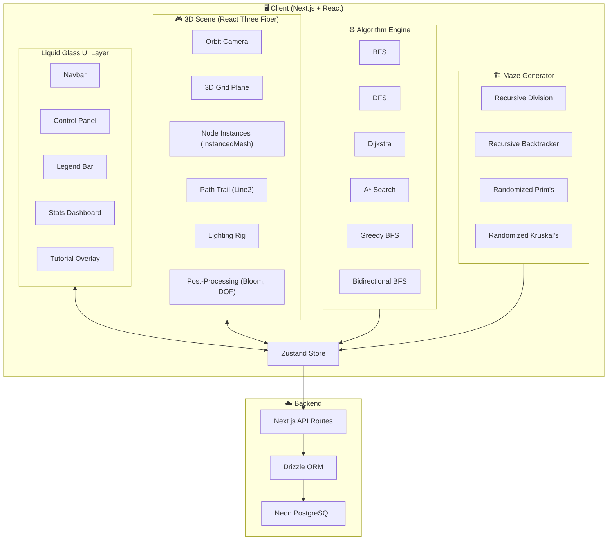
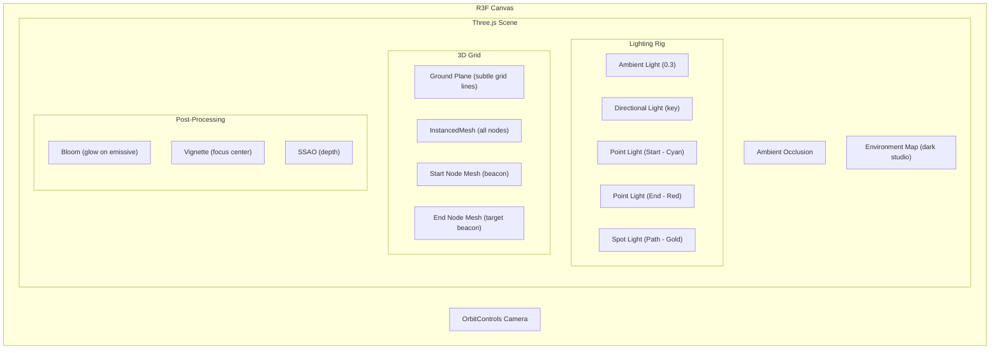
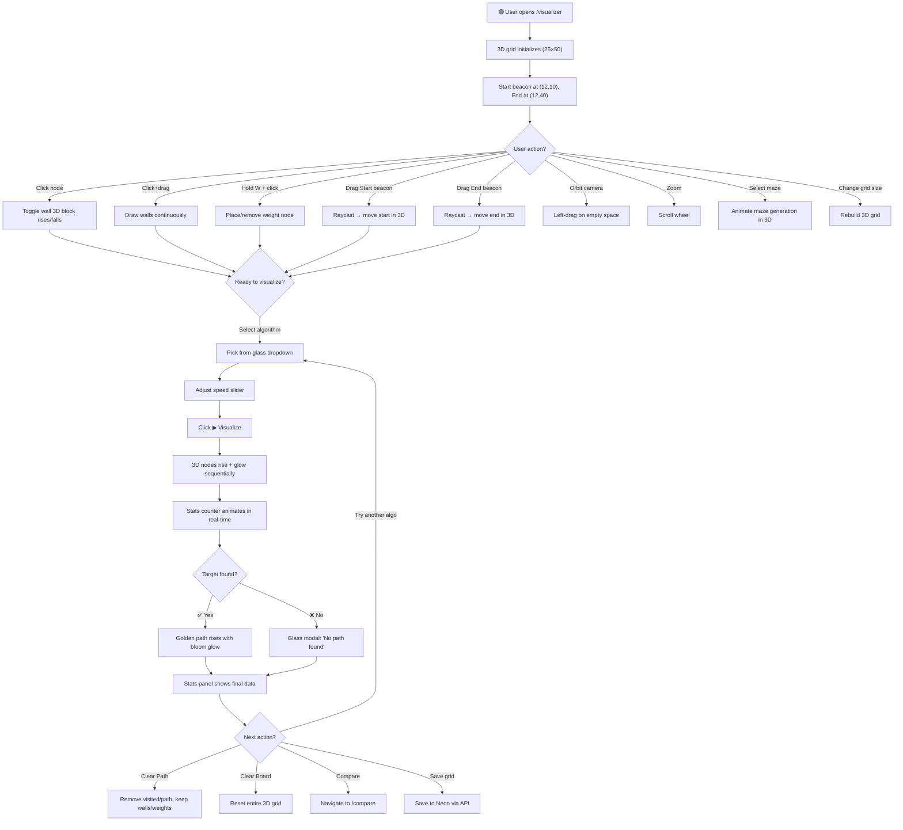

# 🧭 Interactive 3D Pathfinding Visualizer — Master Blueprint

> A production-grade, visually stunning DSA project featuring a **3D interactive visualizer** with **Liquid Glass UI**, real-time algorithm animation, and deep educational content.

---

## 1. Vision & Philosophy

This isn't a basic grid app — it's a **cinematic algorithm experience**. The user doesn't just *see* pathfinding — they **feel** it.

| Principle | Execution |
|-----------|-----------|
| **3D Immersion** | Nodes rise, glow, and pulse in 3D space. Camera orbits around the visualization. |
| **Liquid Glass UI** | Every panel, button, and card uses Apple-style glassmorphism with `backdrop-filter` |
| **Educational Depth** | Each algorithm has pseudocode, complexity analysis, step-by-step explanation |
| **Real-time Feedback** | Live counters for nodes visited, path cost, elapsed time during animation |
| **Micro-interactions** | Every hover, click, and state change has a subtle, satisfying animation |
| **Zero Friction** | No auth required. Open → Visualize → Learn. Instant. |

---

## 2. Tech Stack

| Layer | Technology | Why |
|-------|-----------|-----|
| **Framework** | **Next.js 14+** (App Router) | SSR, file-based routing, React Server Components |
| **Language** | **TypeScript** | Type-safe algorithm logic, impressive for evaluation |
| **3D Engine** | **React Three Fiber (R3F)** + **@react-three/drei** | React-native 3D rendering on Three.js |
| **3D Effects** | **@react-three/postprocessing** | Bloom, glow, depth-of-field for cinematic look |
| **UI Animations** | **Framer Motion** | Spring physics, layout animations, gesture support |
| **3D Animations** | **GSAP** + **R3F useFrame** | Timeline-based 3D node animations |
| **Styling** | **Tailwind CSS 4** + **CSS Modules** | Utility-first + scoped glassmorphism styles |
| **State** | **Zustand** | Lightweight, performant global state (better than Context for 3D) |
| **Database** | **Neon** (Free PostgreSQL) | Free tier: 0.5 GB storage, autoscaling, branching |
| **ORM** | **Drizzle ORM** | Type-safe SQL queries, lightweight, edge-compatible |
| **Icons** | **Lucide React** | Clean, consistent icon set |
| **Fonts** | **Inter** (UI) + **JetBrains Mono** (code) | Premium typography via `next/font` |
| **Charts** | **Recharts** | Stats comparison bar/line charts |
| **Deployment** | **Vercel** | Zero-config, edge functions, analytics |
| **Code Highlighting** | **Shiki** | VS Code-quality syntax highlighting for pseudocode |

### Why Neon over Supabase?

| Feature | Neon (Free) | Why it fits |
|---------|-------------|-------------|
| **Storage** | 0.5 GB | More than enough for grid layouts |
| **Compute** | 0.25 CU (autosuspend) | Free, wakes on demand |
| **Branching** | ✅ | Great for dev/prod separation |
| **No Auth overhead** | ✅ | We don't need auth — Neon is pure PostgreSQL |
| **Edge compatible** | ✅ | Works with Vercel Edge Functions |
| **Connection** | Serverless driver | No connection pooling needed |

> [!TIP]
> **Other free alternatives**: [Turso](https://turso.tech) (SQLite edge, 9GB free), [PlanetScale](https://planetscale.com) (MySQL, 5GB free), [MongoDB Atlas](https://www.mongodb.com/atlas) (512MB free). Neon is recommended because it's PostgreSQL and pairs perfectly with Drizzle ORM.

---

## 3. Architecture



---

## 4. Design System — Liquid Glass + Glassmorphism

### 4.1 Design Philosophy

Inspired by **Apple's Liquid Glass (iOS 26)** and **glassmorphism** trends:
- Semi-transparent surfaces with blur
- Subtle light refraction effects
- Floating panels over the 3D scene
- Vibrant accent colors against dark backgrounds
- Depth through layered glass panels

### 4.2 Color Palette

```
┌─────────────────────────────────────────────────────┐
│  DARK THEME (Primary)                               │
├─────────────────────────────────────────────────────┤
│  Background:       #0a0a0f  (Deep Space Black)      │
│  Surface:          rgba(255,255,255,0.03)            │
│  Glass Primary:    rgba(255,255,255,0.06)            │
│  Glass Secondary:  rgba(255,255,255,0.10)            │
│  Glass Border:     rgba(255,255,255,0.08)            │
│  Glass Highlight:  rgba(255,255,255,0.15)            │
│                                                     │
│  Text Primary:     #f0f0f5  (Snow White)            │
│  Text Secondary:   #8888aa  (Muted Lavender)        │
│  Text Tertiary:    #555577  (Dim Violet)            │
│                                                     │
│  ── ACCENT COLORS ──                                │
│  Cyan (Start):     #00d4ff                          │
│  Red (End):        #ff4757                          │
│  Purple (Visited): #a855f7 → #6366f1 (gradient)    │
│  Gold (Path):      #fbbf24 → #f59e0b               │
│  Green (Current):  #22d3ee                          │
│  Charcoal (Wall):  #1e1e2e                          │
│  Lavender (Weight):#a78bfa                          │
│                                                     │
│  ── GLOW COLORS (3D) ──                             │
│  Cyan Glow:        #00d4ff (emissive intensity 2)   │
│  Path Glow:        #fbbf24 (emissive intensity 3)   │
│  Visited Glow:     #8b5cf6 (emissive intensity 1.5) │
└─────────────────────────────────────────────────────┘
```

### 4.3 Glassmorphism CSS Foundation

```css
/* === LIQUID GLASS SYSTEM === */

.glass {
  background: rgba(255, 255, 255, 0.04);
  backdrop-filter: blur(20px) saturate(180%);
  -webkit-backdrop-filter: blur(20px) saturate(180%);
  border: 1px solid rgba(255, 255, 255, 0.08);
  border-radius: 16px;
  box-shadow:
    0 8px 32px rgba(0, 0, 0, 0.4),
    inset 0 1px 0 rgba(255, 255, 255, 0.06);
}

.glass-elevated {
  background: rgba(255, 255, 255, 0.07);
  backdrop-filter: blur(40px) saturate(200%);
  border: 1px solid rgba(255, 255, 255, 0.12);
  border-radius: 20px;
  box-shadow:
    0 16px 48px rgba(0, 0, 0, 0.5),
    0 0 0 1px rgba(255, 255, 255, 0.05),
    inset 0 1px 0 rgba(255, 255, 255, 0.1);
}

.glass-button {
  background: rgba(255, 255, 255, 0.06);
  backdrop-filter: blur(12px);
  border: 1px solid rgba(255, 255, 255, 0.1);
  border-radius: 12px;
  color: #f0f0f5;
  padding: 10px 20px;
  cursor: pointer;
  transition: all 0.3s cubic-bezier(0.4, 0, 0.2, 1);
}

.glass-button:hover {
  background: rgba(255, 255, 255, 0.12);
  border-color: rgba(255, 255, 255, 0.2);
  box-shadow: 0 4px 20px rgba(0, 212, 255, 0.15);
  transform: translateY(-1px);
}

.glass-button:active {
  transform: translateY(0) scale(0.98);
}

.glass-button-primary {
  background: linear-gradient(135deg, rgba(0, 212, 255, 0.2), rgba(168, 85, 247, 0.2));
  border-color: rgba(0, 212, 255, 0.3);
}

.glass-button-primary:hover {
  background: linear-gradient(135deg, rgba(0, 212, 255, 0.3), rgba(168, 85, 247, 0.3));
  box-shadow:
    0 4px 20px rgba(0, 212, 255, 0.25),
    0 0 40px rgba(168, 85, 247, 0.1);
}

/* Liquid shine effect on hover */
.glass::before {
  content: '';
  position: absolute;
  inset: 0;
  border-radius: inherit;
  background: linear-gradient(
    105deg,
    transparent 40%,
    rgba(255, 255, 255, 0.03) 45%,
    rgba(255, 255, 255, 0.06) 50%,
    rgba(255, 255, 255, 0.03) 55%,
    transparent 60%
  );
  opacity: 0;
  transition: opacity 0.5s;
  pointer-events: none;
}

.glass:hover::before {
  opacity: 1;
}

/* Input fields */
.glass-input {
  background: rgba(0, 0, 0, 0.3);
  backdrop-filter: blur(8px);
  border: 1px solid rgba(255, 255, 255, 0.08);
  border-radius: 10px;
  color: #f0f0f5;
  padding: 10px 16px;
  outline: none;
  transition: border-color 0.3s;
}

.glass-input:focus {
  border-color: rgba(0, 212, 255, 0.5);
  box-shadow: 0 0 20px rgba(0, 212, 255, 0.1);
}

/* Select dropdown */
.glass-select {
  background: rgba(255, 255, 255, 0.05);
  backdrop-filter: blur(12px);
  border: 1px solid rgba(255, 255, 255, 0.1);
  border-radius: 10px;
  color: #f0f0f5;
  padding: 10px 16px;
  appearance: none;
  cursor: pointer;
}

/* Tooltip */
.glass-tooltip {
  background: rgba(15, 15, 25, 0.9);
  backdrop-filter: blur(20px);
  border: 1px solid rgba(255, 255, 255, 0.1);
  border-radius: 10px;
  padding: 8px 14px;
  font-size: 0.8rem;
  box-shadow: 0 8px 32px rgba(0, 0, 0, 0.5);
}
```

### 4.4 Typography

```css
/* Import via next/font for zero-layout-shift */
--font-ui: 'Inter', system-ui, sans-serif;
--font-mono: 'JetBrains Mono', 'Fira Code', monospace;

/* Scale */
--text-xs:   0.75rem;   /* 12px — labels, badges */
--text-sm:   0.875rem;  /* 14px — secondary text */
--text-base: 1rem;      /* 16px — body */
--text-lg:   1.125rem;  /* 18px — emphasis */
--text-xl:   1.25rem;   /* 20px — card titles */
--text-2xl:  1.5rem;    /* 24px — section headers */
--text-3xl:  2rem;      /* 32px — page titles */
--text-4xl:  2.5rem;    /* 40px — hero */
--text-5xl:  3.5rem;    /* 56px — hero landing */
```

### 4.5 Micro-Interactions Inventory

| Element | Interaction | Animation |
|---------|------------|-----------|
| **Glass Button** | Hover | `translateY(-1px)` + glow shadow fade-in |
| **Glass Button** | Click | `scale(0.98)` spring snap |
| **Glass Panel** | Mount | `opacity 0→1` + `translateY(20px→0)` with spring |
| **Algorithm Card** | Hover | Border glow pulse + inner shine sweep |
| **Speed Slider** | Drag | Thumb scales up, track glows |
| **Stats Counter** | Value change | Count-up animation with easing |
| **Tab Switch** | Click | Underline slides with spring physics |
| **Tooltip** | Hover | `scale(0.95→1)` + `opacity 0→1` delayed 300ms |
| **Modal** | Open | Backdrop blur fade + panel `scale(0.9→1)` |
| **Toggle** | Click | Thumb slides + background color morphs |
| **Navbar Logo** | Hover | Subtle 3D tilt with `perspective` |
| **Page Transition** | Navigate | Crossfade with `framer-motion` `AnimatePresence` |

---

## 5. 3D Visualizer — The Core Experience

### 5.1 Scene Architecture



### 5.2 Node 3D Representation

| Node Type | 3D Shape | Material | Effect |
|-----------|----------|----------|--------|
| **Empty** | Flat rounded box (0.8 × 0.1 × 0.8) | `MeshStandardMaterial` — dark, low roughness | Subtle hover glow |
| **Wall** | Tall box (0.8 × 0.8 × 0.8) | `MeshStandardMaterial` — charcoal, rough | Rise animation on placement |
| **Start** | Cylinder + floating ring | `MeshStandardMaterial` — cyan, emissive | Pulsing glow + rotating ring |
| **End** | Octahedron + floating ring | `MeshStandardMaterial` — red, emissive | Pulsing glow + rotating ring |
| **Weight** | Box with gem on top (0.8 × 0.3 × 0.8) | `MeshStandardMaterial` — lavender | Weight icon floating above |
| **Visited** | Box that rises (0.8 × 0.4 × 0.8) | `MeshStandardMaterial` — purple gradient, emissive | Rise up + color shift animation |
| **Path** | Tall glowing box (0.8 × 0.6 × 0.8) | `MeshStandardMaterial` — gold, high emissive | Bloom glow + sequential rise |
| **Current** | Same as visited but highlighted | Bright cyan emissive | Flash animation |

### 5.3 3D Camera & Interaction

```typescript
// Camera setup with OrbitControls
<Canvas
  camera={{ position: [0, 15, 20], fov: 50 }}
  shadows
  gl={{ antialias: true, alpha: false }}
>
  <OrbitControls
    enableDamping
    dampingFactor={0.05}
    minDistance={10}
    maxDistance={40}
    minPolarAngle={Math.PI / 6}   // Don't go below grid
    maxPolarAngle={Math.PI / 2.5} // Don't go too flat
    target={[gridCenterX, 0, gridCenterZ]}
  />
  {/* ... scene contents */}
</Canvas>
```

**User 3D interactions:**
| Action | 3D Behavior |
|--------|------------|
| **Left-click drag (empty space)** | Orbit camera around grid |
| **Right-click drag** | Pan camera |
| **Scroll wheel** | Zoom in/out |
| **Click on node** | Toggle wall / place weight |
| **Drag Start beacon** | Raycasting to new position |
| **Drag End beacon** | Raycasting to new position |
| **Hover over node** | Node glows + tooltip with coordinates |
| **Press R** | Reset camera to default angle |

### 5.4 3D Animation System

```typescript
// Animation controller using GSAP + R3F
function animateVisualization(
  visitedNodes: GridNode[],
  pathNodes: GridNode[],
  speed: number
) {
  const timeline = gsap.timeline();

  // Phase 1: Visited nodes rise and glow sequentially
  visitedNodes.forEach((node, index) => {
    timeline.to(
      nodeRefs[node.row][node.col],
      {
        scaleY: 3,              // Rise up
        y: 0.15,                // Lift off ground
        duration: 0.15,
        ease: 'back.out(1.7)',
      },
      index * (speed / 1000)    // Stagger based on speed
    );

    // Simultaneously change color to visited purple
    timeline.to(
      nodeMaterials[node.row][node.col],
      {
        emissiveIntensity: 1.5,
        duration: 0.3,
      },
      index * (speed / 1000)
    );
  });

  // Phase 2: Path nodes — golden glow wave
  pathNodes.forEach((node, index) => {
    timeline.to(
      nodeRefs[node.row][node.col],
      {
        scaleY: 5,              // Rise higher
        y: 0.3,
        duration: 0.3,
        ease: 'elastic.out(1, 0.5)',
      },
      `path+=${index * 0.05}`
    );

    // Golden emissive bloom
    timeline.to(
      nodeMaterials[node.row][node.col],
      {
        emissiveIntensity: 3,
        duration: 0.4,
      },
      `path+=${index * 0.05}`
    );
  });

  return timeline;
}
```

### 5.5 InstancedMesh for Performance

> [!IMPORTANT]
> A 25×50 grid = 1,250 nodes. Rendering 1,250 separate `<mesh>` components would **destroy** performance. Use **InstancedMesh** to render all nodes as a single draw call.

```typescript
function GridInstances({ grid, rows, cols }: GridProps) {
  const meshRef = useRef<THREE.InstancedMesh>(null);
  const tempObject = useMemo(() => new THREE.Object3D(), []);
  const tempColor = useMemo(() => new THREE.Color(), []);

  useFrame(() => {
    if (!meshRef.current) return;

    for (let row = 0; row < rows; row++) {
      for (let col = 0; col < cols; col++) {
        const index = row * cols + col;
        const node = grid[row][col];

        // Position
        tempObject.position.set(
          col - cols / 2,        // Center grid
          node.height || 0.05,   // Height based on state
          row - rows / 2
        );
        tempObject.scale.set(0.9, node.scaleY || 0.1, 0.9);
        tempObject.updateMatrix();
        meshRef.current.setMatrixAt(index, tempObject.matrix);

        // Color based on node state
        tempColor.set(getNodeColor(node));
        meshRef.current.setColorAt(index, tempColor);
      }
    }

    meshRef.current.instanceMatrix.needsUpdate = true;
    if (meshRef.current.instanceColor)
      meshRef.current.instanceColor.needsUpdate = true;
  });

  return (
    <instancedMesh ref={meshRef} args={[undefined, undefined, rows * cols]}>
      <boxGeometry args={[0.9, 1, 0.9]} />
      <meshStandardMaterial
        vertexColors
        roughness={0.3}
        metalness={0.1}
        emissive="#000000"
        emissiveIntensity={0}
      />
    </instancedMesh>
  );
}
```

---

## 6. All Algorithms — Code + Pseudocode + Explanations

### 6.1 Breadth-First Search (BFS)

#### Explanation
BFS explores the graph **level by level**, like ripples expanding from a stone dropped in water. It uses a **Queue (FIFO)** — first in, first out. Because it processes all nodes at distance *d* before any node at distance *d+1*, the **first time it reaches the target is guaranteed to be the shortest path** (on unweighted graphs).

#### Complexity

$$\text{Time: } O(V + E) = O(R \times C) \quad | \quad \text{Space: } O(V) = O(R \times C)$$

#### Pseudocode

```
BFS(start, end):
    queue ← empty Queue
    visited ← empty Set
    parent ← empty Map
    
    ENQUEUE(queue, start)
    ADD(visited, start)
    
    WHILE queue is NOT empty:
        current ← DEQUEUE(queue)           ← Takes from FRONT
        
        IF current = end:
            RETURN reconstruct_path(parent, end)
        
        FOR each neighbor of current:
            IF neighbor NOT in visited AND neighbor is NOT wall:
                ADD(visited, neighbor)
                parent[neighbor] ← current
                ENQUEUE(queue, neighbor)    ← Adds to BACK
    
    RETURN "No path found"
```

#### TypeScript Implementation

```typescript
export function bfs(
  grid: GridNode[][],
  startNode: GridNode,
  endNode: GridNode
): AlgorithmResult {
  const visitedNodesInOrder: GridNode[] = [];
  const queue: GridNode[] = [startNode];
  startNode.isVisited = true;

  while (queue.length > 0) {
    const current = queue.shift()!;
    visitedNodesInOrder.push(current);

    if (current === endNode) {
      return {
        visitedNodesInOrder,
        shortestPath: reconstructPath(endNode),
        found: true,
      };
    }

    for (const neighbor of getNeighbors(current, grid)) {
      if (!neighbor.isVisited && neighbor.type !== 'wall') {
        neighbor.isVisited = true;
        neighbor.previousNode = current;
        queue.push(neighbor);
      }
    }
  }

  return { visitedNodesInOrder, shortestPath: [], found: false };
}
```

#### 3D Visual Behavior
Expands outward as a **concentric wave** — nodes rise in circular rings from the start node. The most satisfying and intuitive visualization.

---

### 6.2 Depth-First Search (DFS)

#### Explanation
DFS dives as **deep as possible** along one path before backtracking. It uses a **Stack (LIFO)** — last in, first out. It does **NOT guarantee the shortest path** because it commits fully to one direction before trying others.

#### Complexity

$$\text{Time: } O(V + E) = O(R \times C) \quad | \quad \text{Space: } O(V) = O(R \times C)$$

#### Pseudocode

```
DFS(start, end):
    stack ← empty Stack
    visited ← empty Set
    parent ← empty Map
    
    PUSH(stack, start)
    
    WHILE stack is NOT empty:
        current ← POP(stack)               ← Takes from TOP
        
        IF current in visited:
            CONTINUE
        
        ADD(visited, current)
        
        IF current = end:
            RETURN reconstruct_path(parent, end)
        
        FOR each neighbor of current:
            IF neighbor NOT in visited AND neighbor is NOT wall:
                parent[neighbor] ← current
                PUSH(stack, neighbor)       ← Adds to TOP
    
    RETURN "No path found"
```

#### TypeScript Implementation

```typescript
export function dfs(
  grid: GridNode[][],
  startNode: GridNode,
  endNode: GridNode
): AlgorithmResult {
  const visitedNodesInOrder: GridNode[] = [];
  const stack: GridNode[] = [startNode];

  while (stack.length > 0) {
    const current = stack.pop()!;

    if (current.isVisited) continue;
    current.isVisited = true;
    visitedNodesInOrder.push(current);

    if (current === endNode) {
      return {
        visitedNodesInOrder,
        shortestPath: reconstructPath(endNode),
        found: true,
      };
    }

    for (const neighbor of getNeighbors(current, grid)) {
      if (!neighbor.isVisited && neighbor.type !== 'wall') {
        neighbor.previousNode = current;
        stack.push(neighbor);
      }
    }
  }

  return { visitedNodesInOrder, shortestPath: [], found: false };
}
```

#### 3D Visual Behavior
Snakes through the grid as a **long winding path** — nodes rise in a single-file chain. Dramatic contrast with BFS.

---

### 6.3 Dijkstra's Algorithm

#### Explanation
Dijkstra finds the **shortest path in weighted graphs**. It uses a **Priority Queue (Min-Heap)** to always process the node with the **smallest known distance** first. It's the generalized version of BFS for weighted edges.

#### Complexity

$$\text{Time: } O((V + E) \log V) \quad | \quad \text{Space: } O(V)$$

#### Key Insight

> On an **unweighted graph**, Dijkstra degenerates into BFS because all edges have equal weight — the priority queue becomes a regular queue.

#### Pseudocode

```
DIJKSTRA(start, end):
    dist ← Map with all nodes set to ∞
    parent ← empty Map
    visited ← empty Set
    pq ← empty MinHeap (ordered by dist)
    
    dist[start] ← 0
    INSERT(pq, start, 0)
    
    WHILE pq is NOT empty:
        current ← EXTRACT_MIN(pq)
        
        IF current in visited:
            CONTINUE
        ADD(visited, current)
        
        IF current = end:
            RETURN reconstruct_path(parent, end)
        
        FOR each neighbor of current:
            IF neighbor is NOT wall AND neighbor NOT in visited:
                newDist ← dist[current] + weight(neighbor)
                
                IF newDist < dist[neighbor]:
                    dist[neighbor] ← newDist
                    parent[neighbor] ← current
                    INSERT(pq, neighbor, newDist)
    
    RETURN "No path found"
```

#### TypeScript Implementation

```typescript
export function dijkstra(
  grid: GridNode[][],
  startNode: GridNode,
  endNode: GridNode
): AlgorithmResult {
  const visitedNodesInOrder: GridNode[] = [];
  startNode.distance = 0;

  const pq = new MinHeap<GridNode>((a, b) => a.distance - b.distance);
  pq.push(startNode);

  while (pq.size > 0) {
    const current = pq.pop()!;

    if (current.isVisited) continue;
    if (current.type === 'wall') continue;
    if (current.distance === Infinity) break;

    current.isVisited = true;
    visitedNodesInOrder.push(current);

    if (current === endNode) {
      return {
        visitedNodesInOrder,
        shortestPath: reconstructPath(endNode),
        found: true,
      };
    }

    for (const neighbor of getNeighbors(current, grid)) {
      if (!neighbor.isVisited && neighbor.type !== 'wall') {
        const newDist = current.distance + neighbor.weight;
        if (newDist < neighbor.distance) {
          neighbor.distance = newDist;
          neighbor.previousNode = current;
          pq.push(neighbor);
        }
      }
    }
  }

  return { visitedNodesInOrder, shortestPath: [], found: false };
}
```

#### 3D Visual Behavior
Similar to BFS on unweighted grids. On weighted grids, the wave **avoids heavy nodes** — you see it flowing around weighted areas.

---

### 6.4 A* Search

#### Explanation
A* is the **gold standard** for pathfinding. It combines Dijkstra's guarantee with a **heuristic function** that guides the search toward the target. It visits dramatically fewer nodes than Dijkstra while still finding the optimal path.

#### The Formula

$$f(n) = g(n) + h(n)$$

| Term | Meaning |
|------|---------|
| $f(n)$ | Total estimated cost through node $n$ |
| $g(n)$ | Actual cost from **start** to node $n$ |
| $h(n)$ | Heuristic estimate from node $n$ to **target** |

#### Heuristic Functions

| Heuristic | Formula | Use Case |
|-----------|---------|----------|
| **Manhattan** | $\|r_1-r_2\| + \|c_1-c_2\|$ | 4-directional grids ✅ |
| **Euclidean** | $\sqrt{(r_1-r_2)^2+(c_1-c_2)^2}$ | Free movement |
| **Chebyshev** | $\max(\|r_1-r_2\|, \|c_1-c_2\|)$ | 8-directional grids |

> [!IMPORTANT]
> A heuristic is **admissible** if it **never overestimates** the true cost. Manhattan distance is admissible for 4-directional movement. An admissible heuristic guarantees A* finds the optimal path.

#### Complexity

$$\text{Time: } O((V + E) \log V) \text{ (but visits far fewer nodes)} \quad | \quad \text{Space: } O(V)$$

#### Pseudocode

```
A_STAR(start, end):
    g ← Map with all nodes set to ∞
    f ← Map with all nodes set to ∞
    parent ← empty Map
    openSet ← empty MinHeap (ordered by f)
    closedSet ← empty Set
    
    g[start] ← 0
    f[start] ← heuristic(start, end)
    INSERT(openSet, start)
    
    WHILE openSet is NOT empty:
        current ← EXTRACT_MIN(openSet)    ← Node with lowest f
        
        IF current = end:
            RETURN reconstruct_path(parent, end)
        
        ADD(closedSet, current)
        
        FOR each neighbor of current:
            IF neighbor in closedSet OR neighbor is wall:
                CONTINUE
            
            tentative_g ← g[current] + weight(neighbor)
            
            IF tentative_g < g[neighbor]:
                parent[neighbor] ← current
                g[neighbor] ← tentative_g
                f[neighbor] ← g[neighbor] + heuristic(neighbor, end)
                
                IF neighbor NOT in openSet:
                    INSERT(openSet, neighbor)
    
    RETURN "No path found"
```

#### TypeScript Implementation

```typescript
export function aStar(
  grid: GridNode[][],
  startNode: GridNode,
  endNode: GridNode
): AlgorithmResult {
  const visitedNodesInOrder: GridNode[] = [];

  startNode.distance = 0;
  startNode.heuristic = manhattanDistance(startNode, endNode);
  startNode.totalCost = startNode.heuristic;

  const openSet = new MinHeap<GridNode>((a, b) => a.totalCost - b.totalCost);
  openSet.push(startNode);

  while (openSet.size > 0) {
    const current = openSet.pop()!;

    if (current.isVisited) continue;
    if (current.type === 'wall') continue;

    current.isVisited = true;
    visitedNodesInOrder.push(current);

    if (current === endNode) {
      return {
        visitedNodesInOrder,
        shortestPath: reconstructPath(endNode),
        found: true,
      };
    }

    for (const neighbor of getNeighbors(current, grid)) {
      if (!neighbor.isVisited && neighbor.type !== 'wall') {
        const tentativeG = current.distance + neighbor.weight;
        if (tentativeG < neighbor.distance) {
          neighbor.distance = tentativeG;
          neighbor.heuristic = manhattanDistance(neighbor, endNode);
          neighbor.totalCost = neighbor.distance + neighbor.heuristic;
          neighbor.previousNode = current;
          openSet.push(neighbor);
        }
      }
    }
  }

  return { visitedNodesInOrder, shortestPath: [], found: false };
}

function manhattanDistance(a: GridNode, b: GridNode): number {
  return Math.abs(a.row - b.row) + Math.abs(a.col - b.col);
}
```

#### 3D Visual Behavior
The most dramatic — a **directed beam** shoots toward the target, expanding only in the direction of the goal. Far fewer nodes visited than BFS or Dijkstra. Jaw-dropping visual.

---

### 6.5 Greedy Best-First Search

#### Explanation
Greedy BFS only considers the heuristic — $f(n) = h(n)$. It ignores the actual cost $g(n)$. This makes it **extremely fast** but it does **NOT guarantee the shortest path**.

#### Key Difference from A*

$$\text{A*: } f(n) = g(n) + h(n) \quad \text{vs.} \quad \text{Greedy: } f(n) = h(n)$$

#### Complexity

$$\text{Time: } O((V + E) \log V) \quad | \quad \text{Space: } O(V)$$

#### Pseudocode

```
GREEDY_BFS(start, end):
    openSet ← empty MinHeap (ordered by heuristic ONLY)
    visited ← empty Set
    parent ← empty Map
    
    INSERT(openSet, start, heuristic(start, end))
    
    WHILE openSet is NOT empty:
        current ← EXTRACT_MIN(openSet)
        
        IF current in visited: CONTINUE
        ADD(visited, current)
        
        IF current = end:
            RETURN reconstruct_path(parent, end)
        
        FOR each neighbor of current:
            IF neighbor NOT in visited AND neighbor is NOT wall:
                parent[neighbor] ← current
                INSERT(openSet, neighbor, heuristic(neighbor, end))
    
    RETURN "No path found"
```

#### 3D Visual Behavior
A **laser beam** — even more directional than A*, but the resulting path may not be shortest. Great for showing the tradeoff between speed and optimality.

---

### 6.6 Bidirectional BFS

#### Explanation
Run BFS from **both** start and end **simultaneously**. When the two frontiers **collide**, the path is found. This explores roughly half the nodes of regular BFS, because the search area of two small circles is much less than one large circle:

$$\pi r^2 \quad \text{vs.} \quad 2 \times \pi \left(\frac{r}{2}\right)^2 = \frac{\pi r^2}{2}$$

#### Complexity

$$\text{Time: } O(V + E) \text{ (but ~50\% fewer nodes explored)} \quad | \quad \text{Space: } O(V)$$

#### Pseudocode

```
BIDIRECTIONAL_BFS(start, end):
    queueForward ← [start]       visitedForward ← {start}
    queueBackward ← [end]        visitedBackward ← {end}
    parentForward ← {}            parentBackward ← {}
    
    WHILE queueForward AND queueBackward are NOT empty:
        ── Forward step ──
        current ← DEQUEUE(queueForward)
        IF current in visitedBackward:
            RETURN merge_paths(parentForward, parentBackward, current)
        FOR each neighbor:
            IF not visitedForward: mark, set parent, enqueue
        
        ── Backward step ──
        current ← DEQUEUE(queueBackward)
        IF current in visitedForward:
            RETURN merge_paths(parentForward, parentBackward, current)
        FOR each neighbor:
            IF not visitedBackward: mark, set parent, enqueue
    
    RETURN "No path found"
```

#### 3D Visual Behavior
**Two expanding waves** — one cyan from start, one red from end — colliding in the middle. The most visually spectacular animation.

---

## 7. Custom Min-Heap (Priority Queue)

> [!TIP]
> Implementing your own Min-Heap demonstrates deep understanding of data structures. Professors love this.

```typescript
export class MinHeap<T> {
  private heap: T[] = [];

  constructor(private compare: (a: T, b: T) => number) {}

  get size(): number {
    return this.heap.length;
  }

  push(value: T): void {
    this.heap.push(value);
    this.siftUp(this.heap.length - 1);
  }

  pop(): T | undefined {
    if (this.heap.length === 0) return undefined;
    const top = this.heap[0];
    const last = this.heap.pop()!;
    if (this.heap.length > 0) {
      this.heap[0] = last;
      this.siftDown(0);
    }
    return top;
  }

  peek(): T | undefined {
    return this.heap[0];
  }

  private siftUp(index: number): void {
    while (index > 0) {
      const parent = Math.floor((index - 1) / 2);
      if (this.compare(this.heap[index], this.heap[parent]) >= 0) break;
      [this.heap[index], this.heap[parent]] = [this.heap[parent], this.heap[index]];
      index = parent;
    }
  }

  private siftDown(index: number): void {
    const length = this.heap.length;
    while (true) {
      let smallest = index;
      const left = 2 * index + 1;
      const right = 2 * index + 2;

      if (left < length && this.compare(this.heap[left], this.heap[smallest]) < 0)
        smallest = left;
      if (right < length && this.compare(this.heap[right], this.heap[smallest]) < 0)
        smallest = right;
      if (smallest === index) break;

      [this.heap[index], this.heap[smallest]] = [this.heap[smallest], this.heap[index]];
      index = smallest;
    }
  }
}
```

**Heap Operations Complexity:**

| Operation | Time |
|-----------|------|
| `push` | $O(\log n)$ |
| `pop` | $O(\log n)$ |
| `peek` | $O(1)$ |

---

## 8. Maze Generation Algorithms

### 8.1 Recursive Division

```
RECURSIVE_DIVISION(chamber):
    IF chamber is too small: RETURN
    
    orientation ← choose HORIZONTAL or VERTICAL
    
    IF orientation = HORIZONTAL:
        wallRow ← random even row in chamber
        passageCol ← random odd col in chamber
        Draw horizontal wall at wallRow with gap at passageCol
    ELSE:
        wallCol ← random even col in chamber
        passageRow ← random odd row in chamber
        Draw vertical wall at wallCol with gap at passageRow
    
    RECURSE on the two resulting sub-chambers
```

### 8.2 Recursive Backtracker (DFS Maze)

```
RECURSIVE_BACKTRACKER(grid):
    stack ← [random starting cell]
    Mark starting cell as part of maze
    
    WHILE stack is NOT empty:
        current ← PEEK(stack)
        unvisited ← unvisited neighbors 2 steps away
        
        IF unvisited is NOT empty:
            chosen ← random from unvisited
            Remove wall BETWEEN current and chosen
            Mark chosen as visited
            PUSH(stack, chosen)
        ELSE:
            POP(stack)    ← Backtrack
```

### 8.3 Randomized Prim's

```
PRIMS_MAZE(grid):
    Start with grid full of walls
    Pick random cell, mark as passage
    Add its wall-neighbors to wallList
    
    WHILE wallList is NOT empty:
        wall ← random from wallList
        cells ← cells on either side of wall
        
        IF exactly ONE cell is a passage:
            Make wall a passage
            Add new wall-neighbors to wallList
        
        REMOVE wall from wallList
```

### 8.4 Randomized Kruskal's

```
KRUSKALS_MAZE(grid):
    Create a set for each cell (Union-Find)
    edges ← all walls between adjacent cells
    SHUFFLE(edges)
    
    FOR each edge in edges:
        cell1, cell2 ← cells on either side
        
        IF FIND(cell1) ≠ FIND(cell2):
            Remove the wall (make it passage)
            UNION(cell1, cell2)
```

---

## 9. Pages & Component Hierarchy

### 9.1 Page Map

| Route | Page | Purpose |
|-------|------|---------|
| `/` | **Landing** | Hero with animated 3D grid background, feature showcase, CTA |
| `/visualizer` | **Visualizer** ⭐ | Main 3D visualizer — the core of the project |
| `/learn` | **Learn** | Algorithm cards with pseudocode, complexity, step-by-step |
| `/compare` | **Compare** | Side-by-side algorithm comparison with shared grid |

### 9.2 Full Component Tree

```
app/
├── layout.tsx                          # Root layout + fonts + providers
├── page.tsx                            # Landing page
├── globals.css                         # Global styles + glass system
├── visualizer/
│   └── page.tsx                        # Visualizer page
├── learn/
│   └── page.tsx                        # Learn page
├── compare/
│   └── page.tsx                        # Compare page
│
components/
├── layout/
│   ├── Navbar.tsx                      # Glass navbar with nav links
│   ├── Footer.tsx                      # Minimal footer
│   ├── PageTransition.tsx              # Framer Motion page transitions
│   └── GradientBackground.tsx          # Animated gradient mesh background
│
├── three/                              # 3D COMPONENTS
│   ├── Scene.tsx                       # Main R3F Canvas wrapper
│   ├── GridMesh.tsx                    # InstancedMesh grid of nodes
│   ├── NodeMesh.tsx                    # Individual node 3D logic
│   ├── StartBeacon.tsx                 # Start node 3D beacon (cyan)
│   ├── EndBeacon.tsx                   # End node 3D beacon (red)
│   ├── PathTrail.tsx                   # Glowing path line
│   ├── GridPlane.tsx                   # Ground plane with grid lines
│   ├── Lights.tsx                      # Lighting rig
│   ├── PostProcessing.tsx              # Bloom, vignette, SSAO
│   ├── CameraController.tsx            # OrbitControls + presets
│   └── RaycastHandler.tsx              # Mouse interaction with 3D nodes
│
├── controls/                           # CONTROL PANEL
│   ├── ControlPanel.tsx                # Main floating glass panel
│   ├── AlgorithmSelector.tsx           # Dropdown with algorithm descriptions
│   ├── SpeedSlider.tsx                 # Animation speed control
│   ├── GridSizeControl.tsx             # Rows/cols adjuster
│   ├── MazeSelector.tsx                # Maze generation dropdown
│   ├── ActionButtons.tsx               # Visualize, Clear Path, Reset
│   └── WeightToggle.tsx                # Toggle weight placement mode
│
├── stats/                              # REAL-TIME STATS
│   ├── StatsPanel.tsx                  # Floating stats glass card
│   ├── StatCounter.tsx                 # Animated number counter
│   ├── AlgorithmBadge.tsx              # Current algorithm indicator
│   └── ComparisonChart.tsx             # Recharts bar chart
│
├── legend/
│   └── Legend.tsx                      # Node type color legend
│
├── learn/                              # LEARN PAGE
│   ├── AlgorithmCard.tsx               # Glass card per algorithm
│   ├── PseudocodeBlock.tsx             # Shiki syntax-highlighted pseudocode
│   ├── ComplexityTable.tsx             # Time/space complexity table
│   ├── StepByStep.tsx                  # Step-by-step explanation accordion
│   └── ComparisonTable.tsx             # All algorithms comparison table
│
├── landing/                            # LANDING PAGE
│   ├── Hero.tsx                        # Hero section with 3D background
│   ├── FeatureCards.tsx                # Glassmorphism feature showcase
│   ├── AlgorithmShowcase.tsx           # Mini algorithm previews
│   └── CTAButton.tsx                   # "Start Visualizing" button
│
├── tutorial/
│   ├── TutorialOverlay.tsx             # First-time user guide
│   └── StepIndicator.tsx              # Tutorial step progress
│
└── ui/                                 # REUSABLE UI
    ├── GlassCard.tsx                   # Reusable glass panel
    ├── GlassButton.tsx                 # Glass-styled button
    ├── GlassSelect.tsx                 # Glass dropdown
    ├── GlassSlider.tsx                 # Glass range slider
    ├── GlassModal.tsx                  # Glass modal overlay
    ├── GlassTooltip.tsx                # Glass tooltip
    ├── GlassTabs.tsx                   # Glass tab navigation
    ├── GlassToggle.tsx                 # Glass toggle switch
    └── AnimatedCounter.tsx             # Count-up number animation
```

### 9.3 Core Logic & Utilities

```
lib/
├── algorithms/
│   ├── bfs.ts
│   ├── dfs.ts
│   ├── dijkstra.ts
│   ├── astar.ts
│   ├── greedy.ts
│   ├── bidirectional.ts
│   └── helpers.ts                      # getNeighbors, reconstructPath
│
├── maze/
│   ├── recursiveDivision.ts
│   ├── recursiveBacktracker.ts
│   ├── prims.ts
│   ├── kruskals.ts
│   └── random.ts
│
├── data-structures/
│   ├── MinHeap.ts                      # Custom priority queue
│   └── UnionFind.ts                    # For Kruskal's maze
│
├── grid/
│   ├── gridUtils.ts                    # Create, reset, copy, serialize
│   └── types.ts                        # All TypeScript types
│
├── animation/
│   ├── animationController.ts          # GSAP timeline management
│   └── colorUtils.ts                   # Color interpolation for 3D
│
├── db/
│   ├── schema.ts                       # Drizzle ORM schema
│   ├── client.ts                       # Neon connection
│   └── queries.ts                      # CRUD operations
│
└── constants.ts                        # Grid defaults, colors, speeds
```

---

## 10. TypeScript Types

```typescript
// ═══════════════ CORE TYPES ═══════════════

export interface GridNode {
  row: number;
  col: number;
  type: NodeType;
  weight: number;
  isVisited: boolean;
  isPath: boolean;
  distance: number;
  heuristic: number;
  totalCost: number;
  previousNode: GridNode | null;
  // 3D properties
  height: number;        // Y position in 3D
  scaleY: number;        // Y scale for animation
  emissiveIntensity: number;
  color: string;
}

export type NodeType = 'empty' | 'wall' | 'start' | 'end' | 'weight';

export type AlgorithmType =
  | 'bfs'
  | 'dfs'
  | 'dijkstra'
  | 'astar'
  | 'greedy'
  | 'bidirectional';

export type MazeType =
  | 'recursive-division'
  | 'recursive-backtracker'
  | 'prims'
  | 'kruskals'
  | 'random';

export interface AlgorithmResult {
  visitedNodesInOrder: GridNode[];
  shortestPath: GridNode[];
  found: boolean;
}

export interface AlgorithmStats {
  nodesVisited: number;
  pathLength: number;
  pathCost: number;
  executionTimeMs: number;
  found: boolean;
}

// ═══════════════ STORE TYPES ═══════════════

export interface VisualizerStore {
  // Grid
  grid: GridNode[][];
  rows: number;
  cols: number;
  startPos: { row: number; col: number };
  endPos: { row: number; col: number };

  // Interaction
  mouseMode: 'wall' | 'weight' | 'start' | 'end' | 'erase';
  isDrawing: boolean;
  isDragging: 'start' | 'end' | null;

  // Algorithm
  selectedAlgorithm: AlgorithmType;
  isRunning: boolean;
  isPaused: boolean;
  animationSpeed: number;  // 1 (slow) to 100 (instant)

  // Stats
  stats: AlgorithmStats;
  isComplete: boolean;

  // Actions
  initGrid: (rows: number, cols: number) => void;
  toggleWall: (row: number, col: number) => void;
  setWeight: (row: number, col: number) => void;
  moveStart: (row: number, col: number) => void;
  moveEnd: (row: number, col: number) => void;
  setAlgorithm: (algo: AlgorithmType) => void;
  setSpeed: (speed: number) => void;
  runAlgorithm: () => Promise<void>;
  pauseAlgorithm: () => void;
  clearPath: () => void;
  clearBoard: () => void;
  generateMaze: (type: MazeType) => void;
}
```

---

## 11. Zustand Store

```typescript
import { create } from 'zustand';

export const useVisualizerStore = create<VisualizerStore>((set, get) => ({
  grid: [],
  rows: 25,
  cols: 50,
  startPos: { row: 12, col: 10 },
  endPos: { row: 12, col: 40 },
  mouseMode: 'wall',
  isDrawing: false,
  isDragging: null,
  selectedAlgorithm: 'astar',
  isRunning: false,
  isPaused: false,
  animationSpeed: 50,
  stats: {
    nodesVisited: 0,
    pathLength: 0,
    pathCost: 0,
    executionTimeMs: 0,
    found: false,
  },
  isComplete: false,

  initGrid: (rows, cols) => {
    const grid = createEmptyGrid(rows, cols);
    set({ grid, rows, cols });
  },

  runAlgorithm: async () => {
    const { grid, selectedAlgorithm, startPos, endPos, animationSpeed } = get();
    set({ isRunning: true, isComplete: false });

    const startTime = performance.now();
    const algorithm = getAlgorithm(selectedAlgorithm);
    const startNode = grid[startPos.row][startPos.col];
    const endNode = grid[endPos.row][endPos.col];
    const result = algorithm(grid, startNode, endNode);
    const executionTime = performance.now() - startTime;

    // Animate visited nodes
    await animateNodes(result.visitedNodesInOrder, animationSpeed, (count) => {
      set((s) => ({
        stats: { ...s.stats, nodesVisited: count },
      }));
    });

    // Animate path
    await animatePath(result.shortestPath, animationSpeed);

    set({
      isRunning: false,
      isComplete: true,
      stats: {
        nodesVisited: result.visitedNodesInOrder.length,
        pathLength: result.shortestPath.length,
        pathCost: result.found
          ? result.shortestPath.reduce((sum, n) => sum + n.weight, 0)
          : 0,
        executionTimeMs: executionTime,
        found: result.found,
      },
    });
  },

  // ... other actions
}));
```

---

## 12. Database Schema (Neon + Drizzle)

```typescript
// lib/db/schema.ts
import { pgTable, uuid, text, integer, jsonb, boolean, timestamp, real } from 'drizzle-orm/pg-core';

export const gridLayouts = pgTable('grid_layouts', {
  id: uuid('id').primaryKey().defaultRandom(),
  name: text('name').notNull(),
  gridData: jsonb('grid_data').notNull(),       // Serialized walls + weights
  rows: integer('rows').notNull(),
  cols: integer('cols').notNull(),
  startPos: jsonb('start_pos').notNull(),
  endPos: jsonb('end_pos').notNull(),
  isPublic: boolean('is_public').default(true),
  shareCode: text('share_code').unique(),        // 6-char code for sharing
  createdAt: timestamp('created_at').defaultNow(),
});

export const algorithmRuns = pgTable('algorithm_runs', {
  id: uuid('id').primaryKey().defaultRandom(),
  layoutId: uuid('layout_id').references(() => gridLayouts.id),
  algorithm: text('algorithm').notNull(),
  nodesVisited: integer('nodes_visited').notNull(),
  pathLength: integer('path_length').notNull(),
  pathCost: real('path_cost').notNull(),
  executionTimeMs: real('execution_time_ms').notNull(),
  foundPath: boolean('found_path').notNull(),
  createdAt: timestamp('created_at').defaultNow(),
});
```

---

## 13. Page Designs

### 13.1 Landing Page (`/`)

```
┌──────────────────────────────────────────────────────────────┐
│  ◉ Navbar (glass)     [Visualizer]  [Learn]  [Compare]      │
├──────────────────────────────────────────────────────────────┤
│                                                              │
│        ┌─────────────────────────────────────┐               │
│        │     🧭 3D animated grid running     │               │
│        │     A* in the background as          │               │
│        │     a cinematic hero element         │               │
│        └─────────────────────────────────────┘               │
│                                                              │
│     PATHFINDING                                              │
│       VISUALIZER                                             │
│     Experience algorithms in 3D                              │
│                                                              │
│     [ ✨ Start Visualizing →  ]  (glass primary button)      │
│                                                              │
│     ┌──────────┐  ┌──────────┐  ┌──────────┐                │
│     │ 6 Algos  │  │ 4 Mazes  │  │ 3D View  │  (glass cards) │
│     │ BFS,A*.. │  │ Division │  │ Interact │                │
│     └──────────┘  └──────────┘  └──────────┘                │
│                                                              │
└──────────────────────────────────────────────────────────────┘
```

### 13.2 Visualizer Page (`/visualizer`) ⭐

```
┌──────────────────────────────────────────────────────────────┐
│  ◉ Logo    [Algorithm ▾]  [Speed ═══●══]  [▶ Visualize]     │
│            [Maze ▾]       [Grid: 25×50]   [Clear] [Reset]   │
├──────────────────────────────────────────────────────────────┤
│                                                              │
│  ┌──────────────────────────────────────────────────────┐    │
│  │                                                      │    │
│  │          ╔══════════════════════════════╗             │    │
│  │          ║                              ║             │    │
│  │          ║      3D GRID CANVAS          ║             │    │
│  │          ║    (React Three Fiber)       ║             │    │
│  │          ║                              ║             │    │
│  │          ║   🟢 Start    ██ Walls       ║             │    │
│  │          ║                     🔴 End   ║             │    │
│  │          ║                              ║             │    │
│  │          ╚══════════════════════════════╝             │    │
│  │                                                      │    │
│  └──────────────────────────────────────────────────────┘    │
│                                                              │
│  ┌────────────────┐  ┌──────────────────────────────────┐    │
│  │  STATS (glass) │  │  LEGEND (glass)                  │    │
│  │  Visited: 342  │  │  🟦 Empty  🟩 Start  🟥 End     │    │
│  │  Path: 28      │  │  ⬛ Wall   🟪 Visited 🟨 Path   │    │
│  │  Cost: 28      │  │  🟣 Weight                       │    │
│  │  Time: 1.2ms   │  │                                  │    │
│  └────────────────┘  └──────────────────────────────────┘    │
│                                                              │
│  ┌──────────────────────────────────────────────────────┐    │
│  │  ALGORITHM INFO (glass, collapsible)                 │    │
│  │  A* Search — Optimal weighted pathfinding            │    │
│  │  f(n) = g(n) + h(n) using Manhattan heuristic       │    │
│  │  Time: O((V+E) log V)  |  Space: O(V)               │    │
│  └──────────────────────────────────────────────────────┘    │
└──────────────────────────────────────────────────────────────┘
```

### 13.3 Learn Page (`/learn`)

```
┌──────────────────────────────────────────────────────────────┐
│  ◉ Navbar                                                    │
├──────────────────────────────────────────────────────────────┤
│                                                              │
│     📚 Learn the Algorithms                                  │
│     Deep dive into how each pathfinding algorithm works      │
│                                                              │
│  ┌────────────────────────┐  ┌────────────────────────┐      │
│  │  BFS (glass card)      │  │  DFS (glass card)      │      │
│  │  ──────────────────    │  │  ──────────────────    │      │
│  │  Finds shortest path   │  │  Deep exploration      │      │
│  │  O(V+E)  |  Queue      │  │  O(V+E)  |  Stack      │      │
│  │                        │  │                        │      │
│  │  [Pseudocode ▾]        │  │  [Pseudocode ▾]        │      │
│  │  [Step-by-step ▾]      │  │  [Step-by-step ▾]      │      │
│  │  [Try it →]            │  │  [Try it →]            │      │
│  └────────────────────────┘  └────────────────────────┘      │
│                                                              │
│  ┌────────────────────────┐  ┌────────────────────────┐      │
│  │  Dijkstra (glass card) │  │  A* Search (glass card)│      │
│  │  ──────────────────    │  │  ──────────────────    │      │
│  │  Weighted shortest     │  │  Heuristic optimal     │      │
│  │  O((V+E)logV) | Heap   │  │  O((V+E)logV) | Heap   │      │
│  │                        │  │                        │      │
│  │  [Pseudocode ▾]        │  │  [Pseudocode ▾]        │      │
│  │  [f = g + h explained] │  │  [Heuristics ▾]        │      │
│  │  [Try it →]            │  │  [Try it →]            │      │
│  └────────────────────────┘  └────────────────────────┘      │
│                                                              │
│  ═══════ COMPARISON TABLE (glass) ═══════                    │
│  | Algo  | Shortest? | Weighted? | Time      | DS     |     │
│  |-------|-----------|-----------|-----------|--------|     │
│  | BFS   | ✅ unwt   | ❌        | O(V+E)    | Queue  |     │
│  | DFS   | ❌        | ❌        | O(V+E)    | Stack  |     │
│  | Dijk  | ✅        | ✅        | O(VlogV)  | Heap   |     │
│  | A*    | ✅        | ✅        | O(VlogV)  | Heap   |     │
│  | Grdy  | ❌        | ❌        | O(VlogV)  | Heap   |     │
│  | BiDir | ✅ unwt   | ❌        | O(V+E)    | 2×Queue|     │
│                                                              │
└──────────────────────────────────────────────────────────────┘
```

### 13.4 Compare Page (`/compare`)

```
┌──────────────────────────────────────────────────────────────┐
│  ◉ Navbar      [Algo 1: BFS ▾]  [Algo 2: A* ▾]  [▶ Run]   │
├──────────────────────────────────────────────────────────────┤
│                                                              │
│  ┌─────────────────────┐  ┌─────────────────────┐           │
│  │                     │  │                     │           │
│  │  3D GRID — BFS      │  │  3D GRID — A*       │           │
│  │  (same layout)      │  │  (same layout)      │           │
│  │                     │  │                     │           │
│  └─────────────────────┘  └─────────────────────┘           │
│                                                              │
│  ┌────────────────────────────────────────────────┐          │
│  │  COMPARISON STATS (glass)                      │          │
│  │                                                │          │
│  │  ┌──────────┐    ┌──────────┐                  │          │
│  │  │ BFS      │    │ A*       │                  │          │
│  │  │ 342 nodes│    │ 87 nodes │  ← bar chart    │          │
│  │  │ Path: 28 │    │ Path: 28 │                  │          │
│  │  │ 1.2ms    │    │ 0.8ms    │                  │          │
│  │  └──────────┘    └──────────┘                  │          │
│  │                                                │          │
│  │  "A* visited 74% fewer nodes while finding     │          │
│  │   the same optimal path length."               │          │
│  └────────────────────────────────────────────────┘          │
└──────────────────────────────────────────────────────────────┘
```

---

## 14. User Interaction Workflow



---

## 15. Performance Optimization

| Technique | Where | Why |
|-----------|-------|-----|
| **InstancedMesh** | GridMesh | Single draw call for 1250+ nodes |
| **useFrame throttle** | Animation loop | Only update changed instances |
| **React.memo** | UI panels | Prevent re-renders when grid changes |
| **Web Worker** | Algorithm engine | Run pathfinding off main thread |
| **Float32Array** | Instance matrices | Typed arrays for GPU performance |
| **Frustum culling** | R3F default | Don't render off-screen nodes |
| **LOD (Level of Detail)** | Large grids | Simplify distant nodes |
| **Debounced resize** | Grid size control | Don't rebuild on every pixel |
| **requestAnimationFrame** | Animation timing | Sync with browser paint cycle |

---

## 16. Keyboard Shortcuts

| Key | Action |
|-----|--------|
| **Space** | Visualize / Pause |
| **Escape** | Stop visualization |
| **W** | Toggle weight placement mode |
| **E** | Toggle erase mode |
| **C** | Clear path |
| **X** | Clear entire board |
| **R** | Reset camera angle |
| **M** | Generate random maze |
| **1-6** | Select algorithm (1=BFS, 2=DFS, ...) |
| **+/-** | Adjust speed |

---

## 17. Algorithm Comparison Table (For Learn + Compare pages)

| Feature | BFS | DFS | Dijkstra | A* | Greedy BFS | Bidirectional |
|---------|-----|-----|----------|------|------------|---------------|
| **Shortest Path?** | ✅ unweighted | ❌ | ✅ weighted | ✅ weighted | ❌ | ✅ unweighted |
| **Handles Weights?** | ❌ | ❌ | ✅ | ✅ | ❌ | ❌ |
| **Uses Heuristic?** | ❌ | ❌ | ❌ | ✅ | ✅ | ❌ |
| **Data Structure** | Queue | Stack | Min-Heap | Min-Heap | Min-Heap | 2×Queue |
| **Time** | $O(V+E)$ | $O(V+E)$ | $O((V+E)\log V)$ | $O((V+E)\log V)$ | $O((V+E)\log V)$ | $O(V+E)$ |
| **Space** | $O(V)$ | $O(V)$ | $O(V)$ | $O(V)$ | $O(V)$ | $O(V)$ |
| **Nodes Explored** | Many | Variable | Many | Few ⭐ | Fewest | ~Half of BFS |
| **3D Visual** | Ripple wave | Snaking path | Expanding wave | Directed beam | Laser beam | Two colliding waves |

---

## 18. Bonus Features for Full Marks 💯

| Feature | Impact | Difficulty |
|---------|--------|------------|
| 🎮 **3D Interactive Grid** | ⭐⭐⭐⭐⭐ | High |
| 🧊 **Liquid Glass UI** | ⭐⭐⭐⭐⭐ | Medium |
| 📊 **Real-time Stats** | ⭐⭐⭐⭐ | Medium |
| 🏗️ **4 Maze Generators** | ⭐⭐⭐⭐ | Medium |
| 📐 **Compare Mode** | ⭐⭐⭐⭐⭐ | High |
| 📖 **Pseudocode + Complexity** | ⭐⭐⭐⭐⭐ | Low |
| ⚡ **Speed Control** | ⭐⭐⭐ | Low |
| ⚖️ **Weighted Nodes** | ⭐⭐⭐⭐ | Medium |
| 💾 **Save/Share Grids** | ⭐⭐⭐ | Medium |
| ⌨️ **Keyboard Shortcuts** | ⭐⭐⭐ | Low |
| 🎵 **Sound Effects** | ⭐⭐ | Low |
| 📱 **Responsive Design** | ⭐⭐⭐⭐ | Medium |
| 🌊 **Page Transitions** | ⭐⭐⭐ | Low |
| 🔦 **Bloom Post-Processing** | ⭐⭐⭐⭐⭐ | Medium |
| 🧪 **Tutorial Overlay** | ⭐⭐⭐ | Medium |
| 🎯 **Custom Min-Heap** | ⭐⭐⭐⭐⭐ | Medium |

---

## 19. Development Roadmap

### Phase 1: Foundation (Days 1-2)
- [ ] Initialize Next.js + TypeScript + Tailwind
- [ ] Install R3F, drei, postprocessing, framer-motion, gsap, zustand, drizzle-orm
- [ ] Set up project folder structure
- [ ] Create Liquid Glass CSS design system (`globals.css`)
- [ ] Build reusable UI components (`GlassCard`, `GlassButton`, `GlassSelect`, etc.)
- [ ] Set up Zustand store with all types
- [ ] Configure Neon database + Drizzle schema

### Phase 2: 3D Visualizer Core (Days 3-5)
- [ ] Build R3F `Scene` with camera, lights, environment
- [ ] Create `GridMesh` with InstancedMesh
- [ ] Implement `StartBeacon` and `EndBeacon` 3D objects
- [ ] Add `OrbitControls` with constraints
- [ ] Implement raycasting for node click/drag
- [ ] Add wall placement/removal animation (3D rise/fall)
- [ ] Add post-processing (Bloom, Vignette)
- [ ] Implement `GridPlane` with subtle grid lines

### Phase 3: Algorithms (Days 6-7)
- [ ] Implement BFS
- [ ] Implement DFS
- [ ] Implement Dijkstra with MinHeap
- [ ] Implement A* with Manhattan heuristic
- [ ] Implement Greedy Best-First Search
- [ ] Implement Bidirectional BFS
- [ ] Build `reconstructPath` and `getNeighbors` helpers
- [ ] Unit test all algorithms

### Phase 4: Animation Engine (Day 8)
- [ ] Build GSAP timeline for visited node animation (3D rise + color)
- [ ] Build path animation (golden glow wave)
- [ ] Wire speed slider to animation timing
- [ ] Add real-time stats counter updates during animation
- [ ] Add pause/resume support

### Phase 5: Control Panel & Stats (Day 9)
- [ ] Build glass `ControlPanel` overlay
- [ ] Build `AlgorithmSelector` with descriptions
- [ ] Build `SpeedSlider` with glass styling
- [ ] Build `ActionButtons` (Visualize, Clear, Reset)
- [ ] Build `MazeSelector` dropdown
- [ ] Build `StatsPanel` with animated counters
- [ ] Build `Legend` bar

### Phase 6: Maze Generation (Day 10)
- [ ] Implement Recursive Division
- [ ] Implement Recursive Backtracker
- [ ] Implement Randomized Prim's
- [ ] Implement Randomized Kruskal's (with UnionFind)
- [ ] Animate maze generation in 3D

### Phase 7: Learn & Compare Pages (Day 11)
- [ ] Build Learn page with `AlgorithmCard` components
- [ ] Add pseudocode blocks with Shiki syntax highlighting
- [ ] Add complexity tables
- [ ] Add step-by-step accordions
- [ ] Build Compare page with dual 3D scenes
- [ ] Add comparison bar chart (Recharts)
- [ ] Auto-generate comparison text

### Phase 8: Polish & Deploy (Day 12)
- [ ] Build Landing page with 3D hero background
- [ ] Add Framer Motion page transitions
- [ ] Build tutorial overlay for first-time users
- [ ] Add keyboard shortcuts
- [ ] Add save/load grid via Neon API
- [ ] Responsive design adjustments
- [ ] Performance optimization pass
- [ ] Deploy to Vercel

---

## 20. Dependencies (package.json)

```json
{
  "dependencies": {
    "next": "^15.x",
    "@react-three/fiber": "^9.x",
    "@react-three/drei": "^10.x",
    "@react-three/postprocessing": "^3.x",
    "three": "^0.170.x",
    "framer-motion": "^12.x",
    "gsap": "^3.12.x",
    "zustand": "^5.x",
    "recharts": "^2.x",
    "lucide-react": "^0.460.x",
    "shiki": "^1.x",
    "@neondatabase/serverless": "^0.10.x",
    "drizzle-orm": "^0.38.x"
  },
  "devDependencies": {
    "typescript": "^5.x",
    "tailwindcss": "^4.x",
    "@types/three": "^0.170.x",
    "drizzle-kit": "^0.30.x"
  }
}
```

---

> [!CAUTION]
> **Critical Performance Rule**: Never use individual `<mesh>` elements per grid node. Always use `InstancedMesh`. A 25×50 grid with 1,250 individual meshes will run at <10 FPS. InstancedMesh renders them all in **one draw call**.

> [!TIP]
> **Presentation Strategy**: During your viva, pre-load a complex recursive-division maze and run A* vs BFS in compare mode. The visual difference is jaw-dropping — A* visits ~80% fewer nodes. End with Bidirectional BFS for the "two waves colliding" finale.

> [!IMPORTANT]
> **Key Viva Answer**: "A* is optimal because its heuristic (Manhattan distance) is **admissible** — it never overestimates. This means A* will never skip over the true shortest path, while exploring far fewer nodes than Dijkstra by prioritizing nodes that appear closer to the target."
